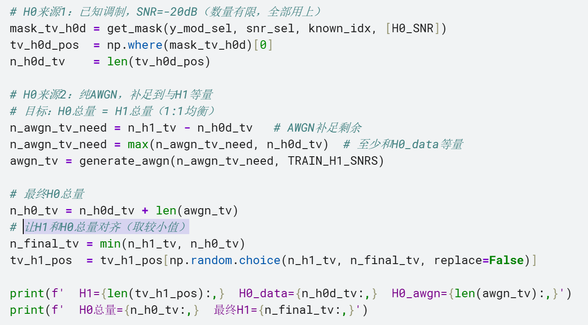
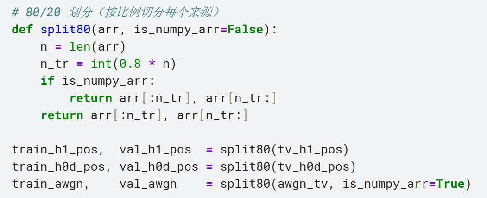

# 讲义代码问题记录

## 一、

## 问题位置

Cell 5:构建训练集处

## 截图



## 问题说明

代码中先是构建H1，即14种已知调制，SNR∈[-10,+10]dB，并算出一共的样本数

然后构建H0来源1，即SNR=-20dB时的样本，并统计样本数

然后构建H0来源2，即纯AWGN，目标是使H0总量 = H1总量

所以论文中用H1总量减去H0来源1总量，算出了应该生成的AWGN总量，如下
n_awgn_tv_need = n_h1_tv - n_h0d_tv

但后面又说要让AWGN总量至少和H0来源1的总量相等，如下
n_awgn_tv_need = max(n_awgn_tv_need, n_h0d_tv)

然后后面又计算了最终H0的总量，如下
n_h0_tv = n_h0d_tv + len(awgn_tv)

然后又让H1和H0总量对齐（取较小值），如下
n_final_tv = min(n_h1_tv, n_h0_tv)

前面说要让 H0 总量等于 H1 总量，但又强行要求 AWGN 数量至少等于 H0_data，可能导致 H0 总量超过 H1，而后面只裁剪 H1、不裁剪 H0，所以最终并不能真正保证 H0 和 H1 严格 1:1 均衡？
我的理解是，是否因为SNR=-20dB数量有限，所以以上问题不会出现

## 二、

## 问题位置

Cell 5:训练/验证集：80/20 划分

## 截图



## 问题说明

是否需要先打乱再划分，虽然对于频谱感知问题，信号的调制方式没有那么重要，但是SNR影响相对较大一点，但是代码中SNR好像也是按顺序排列的，这样划分是否会造成影响

好的，这里是对应的 QA 文档：

---

# 讲义代码问题 QA

## Q1：H0 与 H1 是否能严格 1:1 均衡？

**问题位置：** Cell 5 — 构建训练集处

**问题描述：**
代码中 H0 的构建逻辑如下：
1. 先用 H1 总量减去 H0_data 总量，算出需要补充的 AWGN 数量
2. 再强制要求 AWGN 数量至少等于 H0_data 数量
3. 最后用 `min(n_h1_tv, n_h0_tv)` 对齐 H1 和 H0

这样可能导致 H0 总量超过 H1，而后面只裁剪 H1、不裁剪 H0，是否无法保证严格 1:1 均衡？

**解答：**

从数量关系上分析，`max` 操作是否生效取决于以下条件：

| 条件 | AWGN 数量 | H0 总量 | 是否均衡 |
|---|---|---|---|
| `n_h1_tv ≥ 2 * n_h0d_tv` | `n_h1_tv - n_h0d_tv`，max 不生效 | ≈ n_h1_tv | ✅ 严格 1:1 |
| `n_h1_tv < 2 * n_h0d_tv` | 被强制拉高为 n_h0d_tv | > n_h1_tv | ❌ H0 偏多 |

你的理解是正确的：**由于 SNR=-20dB 的样本数量有限**，在实际数据规模下 `n_h1_tv ≥ 2 * n_h0d_tv` 的条件成立，`max` 操作不会被触发，在 RadioML2018 等标准数据集中，特定的单一 SNR（如 -20dB）样本量通常只占总体的 $1/20$ 或 $1/21$。而 $H_1$ 包含了 14 种调制方式在多个 SNR（-10 到 +10dB）下的并集。数学推导： 假设每种调制每个 SNR 有 $N$ 个样本。$H_1$ 规模约为 $14 \times 11 \times N = 154N$。而 $H_0$ 来源1 规模仅为 $14 \times 1 \times N = 14N$。显然，$154N - 14N$ 远大于 $14N$，所以 max 函数几乎总是取前者，最终 $H_0$ 和 $H_1$ 的不平衡概率极低。因此 H0 总量不会超过 H1，问题在实践中不会出现。

但从代码逻辑严格性来看，这里存在一个潜在隐患：`min` 操作只裁剪了 H1，H0 的总量从未被显式裁剪。若未来数据规模变化导致 `-20dB` 样本增多，可能引发类别不均衡问题。

**建议**： 为了代码的鲁棒性，建议最后统一使用：
```python
min_len = min(len(H0_final), len(H1_final))
H0_final = H0_final[:min_len]
H1_final = H1_final[:min_len]
```
---

## Q2：80/20 划分前是否需要先打乱数据？

**问题位置：** Cell 5 — 训练/验证集 80/20 划分

**问题描述：**
代码中直接按顺序做 80/20 切分，未做 shuffle。由于数据中 SNR 是按顺序排列的，这样切分可能导致训练集和验证集的 SNR 分布不一致，是否会对实验结果造成影响？

**解答：**

从理论上讲，不 shuffle 直接切分确实存在 SNR 分布偏移的风险：训练集会集中在低 SNR 区间，验证集会偏向高 SNR 区间，导致验证集准确率偏高，不能真实反映模型的泛化能力。

**但当前实验中未做 shuffle 的原因是：目前的实验结果已经验证可行，且整体精度在可接受范围内。** 在此前提下，保持现有切分方式是合理的工程决策。

此外，若引入 shuffle 后重新划分，预计验证集中会混入更多低 SNR 的难样本，模型面临更真实的评估分布，**整体精度有望进一步提升**，但也可能使当前的验证指标有所波动，需重新核对实验结论。

如后续需要更严格的对比实验或发表，建议补充 shuffle 后的结果作为对照。

**健壮性拓展：**
先 Shuffle 再 Split。更专业的做法是 分层采样 (Stratified Sampling)：确保每一个 SNR 等级在训练集和验证集中都拥有相同的比例（80/20）。

**建议**： 为了代码的鲁棒性，不要手动切片，直接使用 sklearn 的工具，它默认就会帮你打乱：
```python
from sklearn.model_selection import train_test_split

X_train, X_val, y_train, y_val = train_test_split(
    X_all, y_all, test_size=0.2, random_state=42, shuffle=True
)
```
