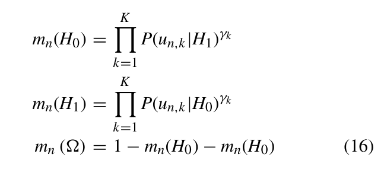

# 第二篇论文公式问题记录

## 问题位置

论文：*Multi-Modal Cooperative Spectrum Sensing Based on Dempster-Shafer Fusion in 5G-Based Cognitive Radio*

问题出现在公式 (16)。该公式用于构造每个 SU 的 BPA 函数：

$$
m_n(H_0),\quad m_n(H_1),\quad m_n(\Omega)
$$

其中：

- $H_0$：PU 不存在；
- $H_1$：PU 存在；
- $\Omega$：不确定状态。

## 原公式截图

## 问题说明

老师您好，我在阅读第二篇论文公式 (16) 时发现一个疑问，想请您帮我确认一下这里是否存在公式错误。

论文中写的是：

$$
\begin{aligned}
m_n(H_0) &= \prod_{k=1}^{K} P(u_{n,k}\mid H_1)^{\gamma_k} \\
m_n(H_1) &= \prod_{k=1}^{K} P(u_{n,k}\mid H_0)^{\gamma_k}
\end{aligned}
$$

我的理解是，$m_n(H_0)$ 表示第 $n$ 个 SU 对 $H_0$ 的 BPA 支持度，理论上应与 $P(u_{n,k}\mid H_0)$ 对应；$m_n(H_1)$ 表示第 $n$ 个 SU 对 $H_1$ 的 BPA 支持度，理论上应与 $P(u_{n,k}\mid H_1)$ 对应。

因此，我认为这里可能将 $H_0$ 和 $H_1$ 的条件概率写反了。即公式是否应改为：

$$
\begin{aligned}
m_n(H_0) &= \prod_{k=1}^{K} P(u_{n,k}\mid H_0)^{\gamma_k} \\
m_n(H_1) &= \prod_{k=1}^{K} P(u_{n,k}\mid H_1)^{\gamma_k}
\end{aligned}
$$

另外，论文中还写道：

$$
m_n(\Omega)=1-m_n(H_0)-m_n(H_0)
$$

这里重复减去了两次 $m_n(H_0)$。按照 BPA 的归一化条件：

$$
m_n(H_0)+m_n(H_1)+m_n(\Omega)=1
$$

我理解这里是否应为：

$$
m_n(\Omega)=1-m_n(H_0)-m_n(H_1)
$$

因此，想请老师确认一下：公式 (16) 中这两处是否为论文印刷错误，还是我对该公式的理解存在偏差？