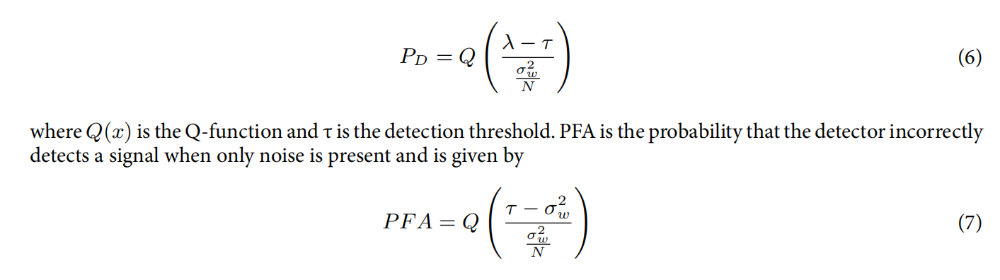
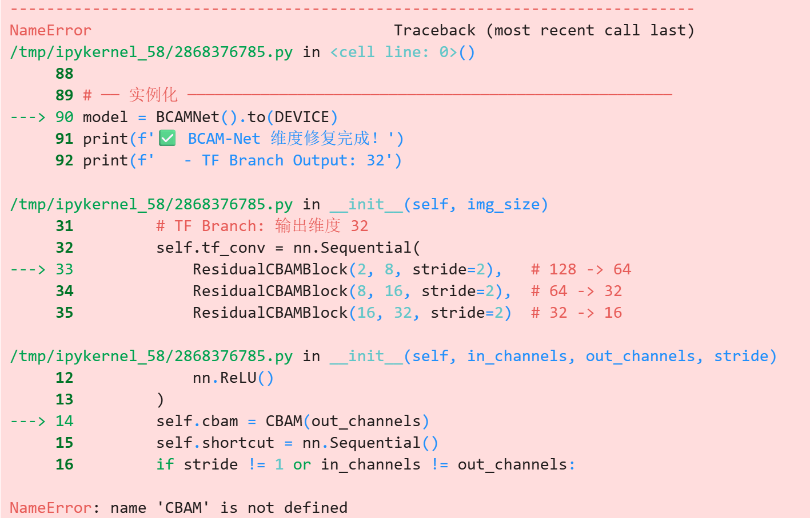

## 问题一

在BiLSTM论文中，这两个公式是不是写的有问题？
公式（6）中是不是把均值近似成了的λ，但是λ应该不是均值吧。
公式（7）中分子是不是符号写反了？

## 问题二

NameError: name 'CBAM' is not defined。
在class ResidualCBAMBlock(nn.Module)前加了:
class ChannelAttention(nn.Module)
class SpatialAttention(nn.Module)
class CBAM(nn.Module)

两个问题分开回答。

---

## 问题1：`NameError: name 'CBAM' is not defined`

这是 Python **类定义顺序**问题。`ResidualCBAMBlock` 在 `__init__` 里调用了 `CBAM(out_channels)`，但 Python 解释器在执行这行时，`CBAM` 类还没有被定义（或者定义在了另一个 cell 里还没运行）。

**解决方法**：确保定义顺序严格按照依赖关系从上到下：

```python
# ── 必须按这个顺序定义，缺一不可 ──────────────────────────────

# 第1步：最底层组件
class ChannelAttention(nn.Module):
    def __init__(self, channels, reduction=16):
        super().__init__()
        self.avg_pool = nn.AdaptiveAvgPool2d(1)
        self.max_pool = nn.AdaptiveMaxPool2d(1)
        self.fc = nn.Sequential(
            nn.Linear(channels, max(1, channels // reduction)),
            nn.ReLU(),
            nn.Linear(max(1, channels // reduction), channels),
        )
        self.sigmoid = nn.Sigmoid()

    def forward(self, x):
        B, C, _, _ = x.shape
        avg = self.fc(self.avg_pool(x).view(B, C))
        mx  = self.fc(self.max_pool(x).view(B, C))
        w   = self.sigmoid(avg + mx).view(B, C, 1, 1)
        return x * w


# 第2步：依赖 ChannelAttention
class SpatialAttention(nn.Module):
    def __init__(self, kernel_size=7):
        super().__init__()
        self.conv = nn.Conv2d(2, 1, kernel_size=kernel_size,
                              padding=kernel_size // 2, bias=False)
        self.sigmoid = nn.Sigmoid()

    def forward(self, x):
        avg = x.mean(dim=1, keepdim=True)
        mx, _ = x.max(dim=1, keepdim=True)
        w = self.sigmoid(self.conv(torch.cat([avg, mx], dim=1)))
        return x * w


# 第3步：依赖 ChannelAttention + SpatialAttention
class CBAM(nn.Module):
    def __init__(self, channels, reduction=16):
        super().__init__()
        self.ca = ChannelAttention(channels, reduction)
        self.sa = SpatialAttention()

    def forward(self, x):
        return self.sa(self.ca(x))


# 第4步：依赖 CBAM  ← 这个必须在 CBAM 之后
class ResidualCBAMBlock(nn.Module):
    def __init__(self, in_channels, out_channels, stride=1):
        super().__init__()
        self.conv = nn.Sequential(
            nn.Conv2d(in_channels, out_channels, 3,
                      stride=stride, padding=1, bias=False),
            nn.BatchNorm2d(out_channels),
            nn.ReLU(),
        )
        self.cbam = CBAM(out_channels)   # ← 此时 CBAM 已定义，不会报错
        self.shortcut = nn.Sequential()
        if stride != 1 or in_channels != out_channels:
            self.shortcut = nn.Sequential(
                nn.Conv2d(in_channels, out_channels, 1,
                          stride=stride, bias=False),
                nn.BatchNorm2d(out_channels),
            )

    def forward(self, x):
        out = self.cbam(self.conv(x))
        return F.relu(out + self.shortcut(x))


# 第5步：最后实例化模型
model = BCAMNet().to(DEVICE)
```

**最常见的错误场景**是把这五个类分散在不同 cell 里，但没有按顺序运行，或者运行了 `BCAMNet` 的 cell 但跳过了中间某个定义 cell。建议把这四个类**放在同一个 cell 里**，一起运行。

---

## 问题2：论文公式(6)(7)的问题

你的直觉是对的，两个公式都有问题，但原因不同。

**先看公式(6)，检测概率 $P_D$：**

$$P_D = Q\!\left(\frac{\lambda - \tau}{\dfrac{\sigma_w^2}{N}}\right) \tag{6}$$

这里 $\lambda$ 确实不是均值。在能量检测中，检验统计量是：

$$T = \frac{1}{N}\sum_{n=1}^{N}|x(n)|^2$$

在 $H_1$ 下，$T$ 的期望值为 $\sigma_w^2 + \sigma_s^2$（噪声功率加信号功率），方差为 $\sigma_w^4/N$。所以公式里的 $\lambda$ 应该是 $H_1$ 下统计量的**均值**，即：

$$\lambda = \sigma_w^2 + \sigma_s^2$$

写成信噪比的形式就是 $\lambda = \sigma_w^2(1 + \text{SNR})$。所以 $\lambda$ 不是信号均值，而是**$H_1$ 下能量统计量的期望值**，论文里没有明确说明这一点，表述确实不够清晰。

**再看公式(7)，虚警概率 $P_{FA}$：**

$$P_{FA} = Q\!\left(\frac{\tau - \sigma_w^2}{\dfrac{\sigma_w^2}{N}}\right) \tag{7}$$

这个公式是**正确的，符号没有写反**。原因如下：

在 $H_0$ 下（纯噪声），能量统计量 $T$ 的均值是 $\sigma_w^2$，方差是 $\sigma_w^4/N$。虚警发生在 $T > \tau$，即：

$$P_{FA} = P(T > \tau \mid H_0) = Q\!\left(\frac{\tau - \mu_{H_0}}{\sigma_{H_0}}\right) = Q\!\left(\frac{\tau - \sigma_w^2}{\sigma_w^2/\sqrt{N}}\right)$$

分子是 $\tau - \sigma_w^2$，**阈值减去均值**，这是标准的 Q 函数形式，没有写反。

如果分子写成 $\sigma_w^2 - \tau$，那意味着计算的是 $P(T < \tau)$，也就是**正确检测**而非虚警，方向相反了。

**结论：**

| 公式 | 问题 | 说明 |
|---|---|---|
| 公式(6) | 有歧义 | $\lambda$ 是 $H_1$ 下能量统计量的期望值，不是信号均值，论文未说清楚 |
| 公式(7) | 正确 | 分子 $\tau - \sigma_w^2$ 是标准写法，没有写反 |
